Assignment 1:

Demonstrate minimum 15 basic docker command with explanation and screenshot.

1. docker –version

This command is used to get the currently installed version of docker
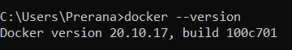

2. docker pull

Usage: docker pull <image name>

This command is used to pull images from the docker repository(hub.docker.com)
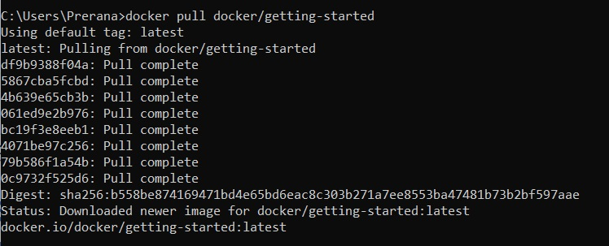

3. docker run

Usage: docker run -it -d <image name>

This command is used to create a container from an image
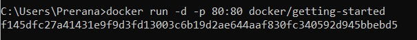

4. docker ps

This command is used to list the running containers
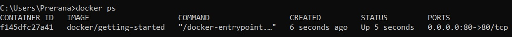

5. docker ps -a

This command is used to show all the running and exited containers
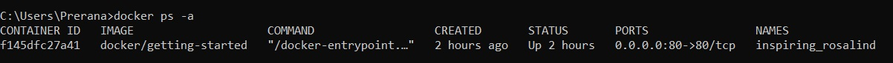

6. docker image ls

Usage: docker image ls

This command is used to list all images that are locally stored with the docker engine
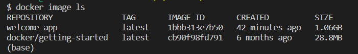

7. docker stop

Usage: docker stop <container id>

This command stops a running container
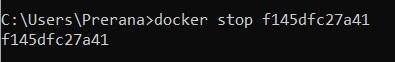

8. docker kill

Usage: docker kill <container id>
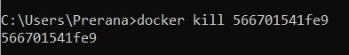

9. docker commit

Usage: docker commit <conatainer id> <username/imagename>

This command creates a new image of an edited container on the local system
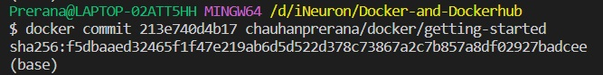

10. docker login

This command is used to login to the docker hub repository
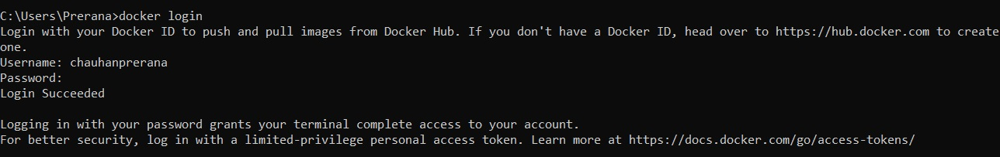

11. docker network ls

Usage: docker network ls

This command is used to list the networks
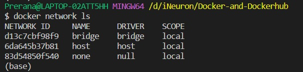

12. docker images

This command lists all the locally stored docker images
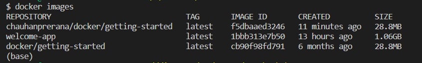

13. docker rm

Usage: docker rm <container id>

This command is used to delete a stopped container
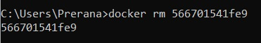

14. docker rmi

Usage: docker rmi <image-id>

This command is used to delete an image from local storage
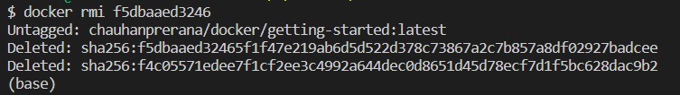

15. docker tag

Usage:  docker tag SOURCE_IMAGE[:TAG] TARGET_IMAGE[:TAG]

This command is used to retag a local image with new image name and tag
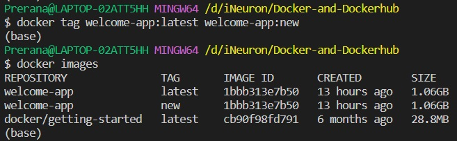
